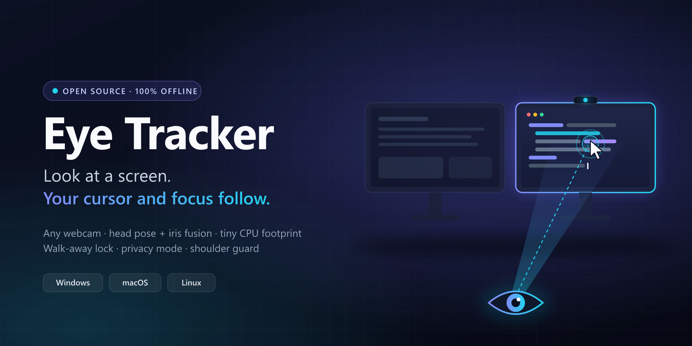
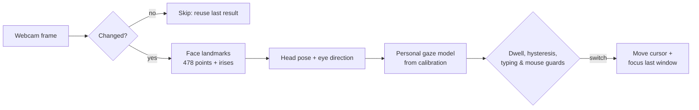

<p align="center">
  
</p>

<h1 align="center">Eye Tracker</h1>

<p align="center">
  Look at a monitor. Your cursor and keyboard focus follow.<br>
  Any webcam, fully offline, on Windows, macOS and Linux.
</p>

<p align="center">
  <a href="https://github.com/bugraskl/eye-tracker/actions/workflows/ci.yml"></a>
  <a href="https://github.com/bugraskl/eye-tracker/releases"></a>
  <a href="docs/platform-support.md"></a>
  <a href="docs/privacy.md"></a>
  <a href="LICENSE"></a>
</p>

<p align="center">
  <b>English</b> · <a href="README.tr.md">Türkçe</a>
</p>

<p align="center">
  
</p>

## Why Eye Tracker

With two or more monitors, you look at the screen you want to work on and then still have to drag the
mouse there and click before you can type. Eye Tracker removes that step. It watches your head and
eyes through the webcam you already have and moves the cursor, and keyboard focus, to the monitor you
are looking at. Your hands stay on the keyboard.

It is an open-source, cross-platform take on the idea behind [Glance Switch](https://glanceswitch.com/),
with extras for privacy and presence: it locks your computer when you walk away, blanks the screen
when someone looks over your shoulder, and never sends a single byte over the network.

## Features

| | Feature | What it does |
|---|---|---|
| 👀 | **Glance to switch** | Look at another monitor for 0.3 s and the cursor lands there, where you left it last time. |
| ⌨️ | **Keyboard focus follows** | The last window you used on that monitor gets focus, without a synthetic click. |
| 🧠 | **Head pose + iris fusion** | 478 face landmarks, including both irises, not just head direction. Works with glasses. |
| 🛡️ | **No accidental switches** | Dwell time, hysteresis at the bezels, typing and mouse grace periods, and glances at your phone or desk are ignored. |
| 📖 | **Reading-aware** | Copying from a document on the other screen? Focus stays in your editor while you read. |
| 🎯 | **Learns as you work** | Every time you move the mouse somewhere and stop, the calibration gets a little better. |
| 🚶 | **Walk-away lock** | No face and no input for 45 s: a 10 s countdown, then lock and/or displays off. Displays wake when you return. |
| 🙈 | **Privacy mode** | One hotkey releases the camera completely; the webcam light goes out. |
| 👥 | **Shoulder guard** | A second face behind you for 2 s: privacy curtain, notification or lock. |
| 📞 | **Plays nice with calls** | Releases the camera automatically when Teams, Zoom or another app needs it. |
| 🔋 | **Tiny CPU footprint** | Adaptive frame rate and a motion gate that skips unchanged frames. |
| 🖥️ | **Any layout** | Two, three or more monitors, side by side, stacked, or a laptop below. One calibration per desk setup. |
| 🚀 | **Starts with your computer** | Optional start at login on all three platforms, in the background. |

## Download

| Platform | Package | |
|---|---|---|
| **Windows** 10/11 x64 | Installer `.exe` or portable `.zip` | [Download](https://github.com/bugraskl/eye-tracker/releases/latest) |
| **macOS** 13+ Apple silicon | `.dmg` | [Download](https://github.com/bugraskl/eye-tracker/releases/latest) |
| **Linux** x86_64 | `.AppImage` or `.tar.gz` | [Download](https://github.com/bugraskl/eye-tracker/releases/latest) |

Every release ships `SHA256SUMS.txt` and GitHub build-provenance attestations. Builds are not
code-signed yet; see [platform notes](docs/platform-support.md) for the one-time Gatekeeper and
SmartScreen steps.

## Quick start

1. Install and start **Eye Tracker**. An eye icon appears in the tray (menu bar on macOS).
2. Follow the short setup: pick your camera, grant permissions on macOS, choose what happens when
   you walk away.
3. **Calibrate**: look at the dots as they appear, about 15 seconds per monitor.
   ([Calibration guide](docs/calibration.md))
4. Work normally. Look at the other monitor and start typing.

Default hotkeys:

| Action | Windows | macOS | Linux (X11) |
|---|---|---|---|
| Pause / resume tracking | `Ctrl+Alt+Win+T` | `⌃⌥T` | `Ctrl+Alt+Shift+T` |
| Privacy mode (camera off) | `Ctrl+Alt+Win+P` | `⌃⌥P` | `Ctrl+Alt+Shift+P` |
| Calibrate | `Ctrl+Alt+Win+C` | `⌃⌥C` | `Ctrl+Alt+Shift+C` |

The defaults avoid combinations that type characters on keyboards with AltGr (Ctrl+Alt+T is `₺` on
Turkish Q, for example). You can change them in **Settings → Hotkeys**. Every other option is listed
in the [configuration reference](docs/configuration.md).

## How it works



- **Vision.** MediaPipe's face-landmark network runs through OpenCV's DNN module. The MediaPipe
  runtime is not used, because it contains a telemetry uploader ([why](docs/privacy.md#why-not-the-mediapipe-runtime)).
- **Personal model.** Calibration fits a small regression from your head angles and iris positions
  to screen positions. Its accuracy is graded honestly with leave-one-point-out cross-validation.
- **Decision.** A switch needs a steady look past the bezel for 0.3 s, and is held back while you type,
  use the mouse or read the other screen during typing.
- **Action.** The cursor returns to where you left it on that monitor, and the last window you used
  there gets keyboard focus.

Deeper dive: [architecture](docs/architecture.md).

## Privacy

| Promise | Verified by |
|---|---|
| No network access at all: no telemetry, no update checks, no accounts. | A source scan and a scan of every built bundle's native libraries fail CI on networking code. |
| Camera frames are analysed in memory and never saved. | The source scan fails CI on any image or video writing API. |
| Only numbers are stored: head angles, iris ratios, screen points. | `calibration.json` is plain JSON. |
| Privacy mode, pause and a locked screen release the camera. | The webcam light goes out. |
| Typing is detected from the OS idle timer, never by reading keys. | [`engine/input_state.py`](src/eye_tracker/engine/input_state.py) |

Details: [privacy](docs/privacy.md).

## Performance

<!-- PERF:BEGIN -->
Measured with `eye-tracker bench` (details and your own numbers: `eye-tracker bench`).
<!-- PERF:END -->

Eye Tracker analyses between 1 and 12 frames per second depending on what is happening, and skips
frames in which nothing moved. Choose **Eco** for the lowest CPU use or **Responsive** for the
fastest reactions under **Settings → Camera & performance**.

## Command line

```bash
eye-tracker                     # start the tray app
eye-tracker calibrate           # calibrate now (or ask the running app to)
eye-tracker doctor              # diagnostics: camera, monitors, permissions, features
eye-tracker bench               # measure CPU use and latency on this machine
eye-tracker ctl privacy-toggle  # control the running app: show, settings, pause, resume, toggle,
                                # privacy-on, privacy-off, privacy-toggle, calibrate, status, quit
eye-tracker autostart enable    # start at login (enable | disable | status)
eye-tracker reset --all         # forget calibrations and settings
```

`eye-tracker ctl` also lets you bind actions to your own keyboard shortcuts, for example on Wayland
where global hotkeys are not available.

## Platform support

| | Windows | macOS | Linux X11 | Linux Wayland |
|---|:---:|:---:|:---:|:---:|
| Cursor follows gaze | ✅ | ✅ | ✅ | ⚠️ sway, Hyprland, or ydotool |
| Keyboard focus follows | ✅ | ✅ | ✅ | ❌ |
| Walk-away lock, privacy mode, shoulder guard | ✅ | ✅ | ✅ | ✅ |
| Global hotkeys | ✅ | ✅ | ✅ | via `eye-tracker ctl` |

Full matrix and per-platform notes: [platform support](docs/platform-support.md).

## Compared with Glance Switch

Glance Switch inspired this project. This comparison uses the features listed on
[glanceswitch.com](https://glanceswitch.com/) in September 2026.

| | Eye Tracker | Glance Switch |
|---|---|---|
| Platforms | Windows, macOS, Linux | macOS 14+ |
| Price | Free, MIT licence | $14.99 one-time |
| Source code | Open | Closed |
| Network use | None | Licence key check |
| Tracking | Head pose + iris landmarks | Head pose (+ eye position for panes) |
| Split-pane focus in terminals and editors | Not yet | ✅ |
| Learns from your mouse use | ✅ | ✅ (from clicks) |
| Walk-away lock / displays off | ✅ | Not listed |
| Shoulder-surfer guard | ✅ | Not listed |
| Automatic camera hand-off to calls | ✅ | Not listed |

## Run from source

Requires [uv](https://docs.astral.sh/uv/) (it fetches the right Python itself).

```bash
git clone https://github.com/bugraskl/eye-tracker.git
cd eye-tracker
uv sync
uv run eye-tracker
```

This is also the way to run Eye Tracker on Intel Macs and on Linux distributions older than the
AppImage supports. Building installers yourself: [building](docs/building.md).

## FAQ

<details>
<summary><b>Does it work with glasses?</b></summary>

Yes. Strong reflections can hide the irises; if the calibration grade is poor, tilt the camera or the
lamp slightly.
</details>

<details>
<summary><b>I have one monitor. Is this useful?</b></summary>

Switching needs two or more monitors, but walk-away lock, privacy mode and the shoulder guard work
with one.
</details>

<details>
<summary><b>Will it steal focus while I'm typing?</b></summary>

No. Nothing switches while you type (and for 2 s after), while you use the mouse (1.5 s), or while
you pause to read the other monitor during typing (6 s). All of these are adjustable.
</details>

<details>
<summary><b>What happens when I look at my phone?</b></summary>

Glances away from every monitor are recognised from your calibrated range of head and eye movement
and ignored.
</details>

<details>
<summary><b>Does it record me?</b></summary>

No. Frames exist only in memory for a few milliseconds while they are analysed. Nothing is written to
disk or sent anywhere. See [privacy](docs/privacy.md).
</details>

<details>
<summary><b>Can I use an external webcam?</b></summary>

Yes, any webcam works. Place it where it stays, ideally centred above your monitors, and recalibrate
if you move it.
</details>

## Roadmap

- Split-pane focus for terminals and editors
- Signed and notarised builds
- Intel macOS builds
- Translations of the user interface

Ideas and bug reports are welcome in [issues](https://github.com/bugraskl/eye-tracker/issues).

## Contributing

Read [CONTRIBUTING.md](CONTRIBUTING.md). Accuracy reports from real desk setups, reproducible bug
reports with `eye-tracker doctor` output, and focused pull requests are the most valuable
contributions. Security or privacy problems: please follow [SECURITY.md](SECURITY.md).

If Eye Tracker saves you a few hundred mouse trips a day, consider **starring the repository**. It
helps other multi-monitor users find it.

## Acknowledgements

- [MediaPipe Face Landmarker](https://ai.google.dev/edge/mediapipe/solutions/vision/face_landmarker) model by Google (Apache-2.0)
- [YuNet](https://github.com/opencv/opencv_zoo/tree/main/models/face_detection_yunet) face detector (MIT)
- [OpenCV](https://opencv.org/) (Apache-2.0) and [Qt for Python](https://doc.qt.io/qtforpython-6/) (LGPLv3)

## License

[MIT](LICENSE)
