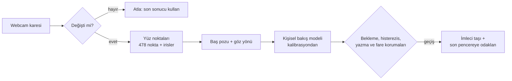

<p align="center">
  
</p>

<h1 align="center">Eye Tracker</h1>

<p align="center">
  Bir monitöre bakın. İmleç ve klavye odağı peşinizden gelsin.<br>
  Herhangi bir webcam ile, tamamen çevrimdışı; Windows, macOS ve Linux'ta.
</p>

<p align="center">
  <a href="https://github.com/bugraskl/eye-tracker/actions/workflows/ci.yml"></a>
  <a href="https://github.com/bugraskl/eye-tracker/releases"></a>
  <a href="docs/platform-support.md"></a>
  <a href="docs/privacy.md"></a>
  <a href="LICENSE"></a>
</p>

<p align="center">
  <a href="README.md">English</a> · <b>Türkçe</b>
</p>

<p align="center">
  
</p>

## Neden Eye Tracker

İki veya daha fazla monitörle çalışırken çalışmak istediğiniz ekrana bakarsınız, ama yazmaya
başlamadan önce fareyi oraya sürükleyip bir kez tıklamanız gerekir. Eye Tracker bu adımı ortadan
kaldırır. Zaten sahip olduğunuz webcam ile başınızı ve gözlerinizi izler; imleci ve klavye odağını
baktığınız monitöre taşır. Elleriniz klavyede kalır.

[Glance Switch](https://glanceswitch.com/)'in fikrinin açık kaynaklı ve çok platformlu bir
yorumudur. Gizlilik ve varlık algılama için ek özellikleri vardır: siz uzaklaşınca bilgisayarı
kilitler, biri omzunuzun üzerinden bakınca ekranı perdeler ve ağa tek bir bayt bile göndermez.

## Özellikler

| | Özellik | Ne yapar |
|---|---|---|
| 👀 | **Bakarak geçiş** | Başka bir monitöre 0,3 sn bakın; imleç oraya, en son bıraktığınız yere gider. |
| ⌨️ | **Klavye odağı da gelir** | O monitörde en son kullandığınız pencere odağı alır; yapay tıklama yapılmaz. |
| 🧠 | **Baş pozu + iris füzyonu** | Sadece baş yönü değil; iki iris dahil 478 yüz noktası. Gözlükle de çalışır. |
| 🛡️ | **Yanlışlıkla geçiş yok** | Bekleme süresi, çerçeve kenarında histerezis, yazma ve fare bekleme süreleri; telefona veya masaya kısa bakışlar yok sayılır. |
| 📖 | **Okumayı anlar** | Diğer ekrandaki bir belgeden mi kopyalıyorsunuz? Siz okurken odak editörünüzde kalır. |
| 🎯 | **Kullandıkça öğrenir** | Fareyi bir yere götürüp her durdurduğunuzda kalibrasyon biraz daha iyileşir. |
| 🚶 | **Uzaklaşınca kilit** | 45 sn boyunca yüz ve girdi yoksa 10 sn geri sayım, ardından kilit ve/veya ekranları kapatma. Döndüğünüzde ekranlar açılır. |
| 🙈 | **Gizlilik modu** | Tek kısayolla kamera tamamen bırakılır; webcam ışığı söner. |
| 👥 | **Omuz koruması** | Arkanızda 2 sn boyunca ikinci bir yüz: gizlilik perdesi, bildirim veya kilit. |
| 📞 | **Görüşmelerle uyumlu** | Teams, Zoom veya başka bir uygulama kameraya ihtiyaç duyunca kamerayı otomatik bırakır. |
| 🔋 | **Çok düşük CPU** | Uyarlanabilir kare hızı ve değişmeyen kareleri atlayan hareket kapısı. |
| 🖥️ | **Her düzen** | İki, üç veya daha fazla monitör; yan yana, üst üste ya da altta bir dizüstü. Her masa düzeni için ayrı kalibrasyon. |
| 🚀 | **Bilgisayarla birlikte açılır** | Üç platformda da isteğe bağlı olarak oturum açılışında arka planda başlar. |

## İndirme

| Platform | Paket | |
|---|---|---|
| **Windows** 10/11 x64 | Kurulum `.exe` veya taşınabilir `.zip` | [İndir](https://github.com/bugraskl/eye-tracker/releases/latest) |
| **macOS** 13+ Apple silicon | `.dmg` | [İndir](https://github.com/bugraskl/eye-tracker/releases/latest) |
| **Linux** x86_64 | `.AppImage` veya `.tar.gz` | [İndir](https://github.com/bugraskl/eye-tracker/releases/latest) |

Her sürümde `SHA256SUMS.txt` ve GitHub derleme kaynağı (provenance) doğrulamaları bulunur. Derlemeler
henüz kod imzalı değildir; Gatekeeper ve SmartScreen için tek seferlik adımlar
[platform notlarında](docs/platform-support.md).

## Hızlı başlangıç

1. **Eye Tracker**'ı kurup başlatın. Bildirim alanında (macOS'ta menü çubuğunda) bir göz simgesi
   belirir.
2. Kısa kurulumu izleyin: kamerayı seçin, macOS'ta izinleri verin, uzaklaştığınızda ne olacağını
   belirleyin.
3. **Kalibre edin**: beliren noktalara bakın; monitör başına yaklaşık 15 saniye sürer.
   ([Kalibrasyon rehberi](docs/calibration.md), İngilizce)
4. Normal çalışın. Diğer monitöre bakın ve yazmaya başlayın.

Varsayılan kısayollar:

| Eylem | Windows | macOS | Linux (X11) |
|---|---|---|---|
| İzlemeyi duraklat / sürdür | `Ctrl+Alt+Win+T` | `⌃⌥T` | `Ctrl+Alt+Shift+T` |
| Gizlilik modu (kamera kapalı) | `Ctrl+Alt+Win+P` | `⌃⌥P` | `Ctrl+Alt+Shift+P` |
| Kalibrasyon | `Ctrl+Alt+Win+C` | `⌃⌥C` | `Ctrl+Alt+Shift+C` |

Varsayılanlar, AltGr'li klavyelerde karakter yazan kombinasyonlardan kaçınır (örneğin Türkçe Q
klavyede Ctrl+Alt+T `₺` yazar). **Ayarlar → Hotkeys** bölümünden değiştirebilirsiniz. Diğer tüm
seçenekler [ayar referansında](docs/configuration.md) listelenir.

## Nasıl çalışır



- **Görüntü.** MediaPipe'ın yüz noktası ağı OpenCV'nin DNN modülüyle çalıştırılır. MediaPipe
  çalışma zamanı kullanılmaz, çünkü içinde bir telemetri gönderici bulunur
  ([neden](docs/privacy.md#why-not-the-mediapipe-runtime)).
- **Kişisel model.** Kalibrasyon, baş açılarınızdan ve iris konumlarınızdan ekran konumlarına küçük
  bir regresyon modeli öğrenir. Doğruluğu, her noktayı onu hiç görmemiş bir modelle tahmin eden
  çapraz doğrulamayla dürüstçe notlanır.
- **Karar.** Geçiş için çerçeve kenarının ötesine 0,3 sn kararlı bakış gerekir; yazarken, fare
  kullanırken veya yazma sırasında diğer ekrandan okurken geçiş bekletilir.
- **Eylem.** İmleç o monitörde bıraktığınız yere döner ve orada en son kullandığınız pencere klavye
  odağını alır.

Ayrıntılar: [mimari](docs/architecture.md) (İngilizce).

## Gizlilik

| Söz | Nasıl doğrulanıyor |
|---|---|
| Hiç ağ erişimi yok: telemetri, güncelleme kontrolü ve hesap yok. | Kaynak kod taraması ve her derlemedeki native kütüphanelerin taranması, ağ kodu bulunursa CI'ı başarısız kılar. |
| Kamera kareleri bellekte analiz edilir, asla kaydedilmez. | Kaynak kod taraması, görüntü veya video yazan her API'de CI'ı başarısız kılar. |
| Sadece sayılar saklanır: baş açıları, iris oranları, ekran noktaları. | `calibration.json` düz bir JSON dosyasıdır. |
| Gizlilik modu, duraklatma ve kilitli ekran kamerayı bırakır. | Webcam ışığı söner. |
| Yazma, tuşlar okunarak değil, işletim sisteminin boşta kalma sayacıyla algılanır. | [`engine/input_state.py`](src/eye_tracker/engine/input_state.py) |

Ayrıntılar: [gizlilik](docs/privacy.md) (İngilizce).

## Performans

<!-- PERF:BEGIN -->
`eye-tracker bench` ile ölçülmüştür (kendi makinenizde ölçmek için: `eye-tracker bench`).
<!-- PERF:END -->

Eye Tracker, duruma göre saniyede 1 ile 12 arasında kare analiz eder ve hiçbir şeyin kıpırdamadığı
kareleri atlar. En düşük CPU için **Eco**, en hızlı tepki için **Responsive** profilini
**Ayarlar → Camera & performance** bölümünden seçebilirsiniz.

## Komut satırı

```bash
eye-tracker                     # bildirim alanı uygulamasını başlat
eye-tracker calibrate           # şimdi kalibre et (veya çalışan uygulamadan iste)
eye-tracker doctor              # tanılama: kamera, monitörler, izinler, özellikler
eye-tracker bench               # bu makinede CPU kullanımını ve gecikmeyi ölç
eye-tracker ctl privacy-toggle  # çalışan uygulamayı yönet: show, settings, pause, resume, toggle,
                                # privacy-on, privacy-off, privacy-toggle, calibrate, status, quit
eye-tracker autostart enable    # oturum açılışında başlat (enable | disable | status)
eye-tracker reset --all         # kalibrasyonları ve ayarları sıfırla
```

`eye-tracker ctl`, eylemleri kendi klavye kısayollarınıza bağlamanızı da sağlar; örneğin global
kısayolların bulunmadığı Wayland'da.

## Platform desteği

| | Windows | macOS | Linux X11 | Linux Wayland |
|---|:---:|:---:|:---:|:---:|
| İmleç bakışı izler | ✅ | ✅ | ✅ | ⚠️ sway, Hyprland veya ydotool |
| Klavye odağı izler | ✅ | ✅ | ✅ | ❌ |
| Uzaklaşınca kilit, gizlilik modu, omuz koruması | ✅ | ✅ | ✅ | ✅ |
| Global kısayollar | ✅ | ✅ | ✅ | `eye-tracker ctl` ile |

Tam tablo ve platform notları: [platform desteği](docs/platform-support.md) (İngilizce).

## Glance Switch ile karşılaştırma

Bu proje Glance Switch'ten ilham aldı. Karşılaştırma, [glanceswitch.com](https://glanceswitch.com/)
üzerinde Eylül 2026'da listelenen özelliklere dayanır.

| | Eye Tracker | Glance Switch |
|---|---|---|
| Platformlar | Windows, macOS, Linux | macOS 14+ |
| Fiyat | Ücretsiz, MIT lisansı | 14,99 $ tek seferlik |
| Kaynak kod | Açık | Kapalı |
| Ağ kullanımı | Yok | Lisans anahtarı kontrolü |
| İzleme | Baş pozu + iris noktaları | Baş pozu (+ paneller için göz konumu) |
| Terminal ve editörlerde bölünmüş panel odağı | Henüz yok | ✅ |
| Fare kullanımından öğrenme | ✅ | ✅ (tıklamalardan) |
| Uzaklaşınca kilit / ekranları kapatma | ✅ | Listelenmemiş |
| Omuz koruması | ✅ | Listelenmemiş |
| Görüşmelere otomatik kamera devri | ✅ | Listelenmemiş |

## Kaynaktan çalıştırma

[uv](https://docs.astral.sh/uv/) gerekir (doğru Python sürümünü kendisi indirir).

```bash
git clone https://github.com/bugraskl/eye-tracker.git
cd eye-tracker
uv sync
uv run eye-tracker
```

Intel Mac'lerde ve AppImage'ın desteklediğinden eski Linux dağıtımlarında da bu yol kullanılır.
Kurulum paketlerini kendiniz derlemek için: [derleme](docs/building.md) (İngilizce).

## SSS

<details>
<summary><b>Gözlükle çalışır mı?</b></summary>

Evet. Güçlü yansımalar irisleri gizleyebilir; kalibrasyon notu düşük çıkarsa kamerayı veya lambayı
hafifçe eğin.
</details>

<details>
<summary><b>Tek monitörüm var. İşime yarar mı?</b></summary>

Geçiş için iki veya daha fazla monitör gerekir; ancak uzaklaşınca kilit, gizlilik modu ve omuz
koruması tek monitörle de çalışır.
</details>

<details>
<summary><b>Yazarken odağı çalar mı?</b></summary>

Hayır. Yazarken (ve sonrasında 2 sn), fare kullanırken (1,5 sn) ve yazma sırasında diğer monitörü
okumak için durduğunuzda (6 sn) geçiş yapılmaz. Bu sürelerin hepsi ayarlanabilir.
</details>

<details>
<summary><b>Telefonuma baktığımda ne olur?</b></summary>

Tüm monitörlerin dışına yapılan bakışlar, kalibre edilmiş baş ve göz hareket aralığınıza göre
tanınır ve yok sayılır.
</details>

<details>
<summary><b>Beni kaydediyor mu?</b></summary>

Hayır. Kareler analiz edildikleri birkaç milisaniye boyunca yalnızca bellekte bulunur. Hiçbir şey
diske yazılmaz veya bir yere gönderilmez. Bkz. [gizlilik](docs/privacy.md).
</details>

<details>
<summary><b>Harici webcam kullanabilir miyim?</b></summary>

Evet, her webcam çalışır. Sabit kalacağı bir yere, ideal olarak monitörlerinizin ortasının üstüne
yerleştirin; yerini değiştirirseniz yeniden kalibre edin.
</details>

## Yol haritası

- Terminal ve editörler için bölünmüş panel odağı
- İmzalı ve notarize edilmiş derlemeler
- Intel macOS derlemeleri
- Arayüz çevirileri

Fikirlerinizi ve hata bildirimlerinizi [issues](https://github.com/bugraskl/eye-tracker/issues)
bölümüne bekliyoruz.

## Katkıda bulunma

[CONTRIBUTING.md](CONTRIBUTING.md) dosyasını okuyun. Gerçek masa düzenlerinden doğruluk raporları,
`eye-tracker doctor` çıktısı içeren yeniden üretilebilir hata bildirimleri ve odaklı pull
request'ler en değerli katkılardır. Güvenlik veya gizlilik sorunları için lütfen
[SECURITY.md](SECURITY.md) dosyasını izleyin.

Eye Tracker size günde birkaç yüz fare hareketi kazandırıyorsa **depoya yıldız vermeyi** düşünün;
diğer çok monitörlü kullanıcıların onu bulmasına yardımcı olur.

## Teşekkürler

- Google'ın [MediaPipe Face Landmarker](https://ai.google.dev/edge/mediapipe/solutions/vision/face_landmarker) modeli (Apache-2.0)
- [YuNet](https://github.com/opencv/opencv_zoo/tree/main/models/face_detection_yunet) yüz algılayıcı (MIT)
- [OpenCV](https://opencv.org/) (Apache-2.0) ve [Qt for Python](https://doc.qt.io/qtforpython-6/) (LGPLv3)

## Lisans

[MIT](LICENSE)
