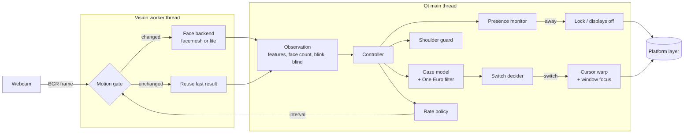
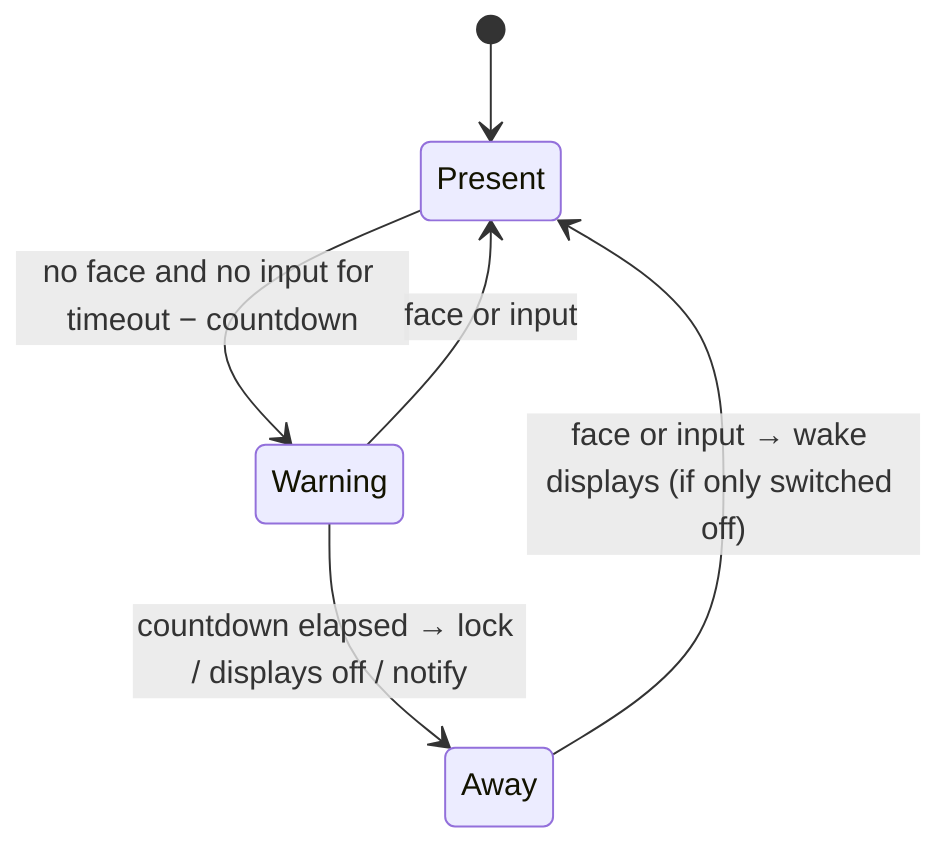

# Architecture

Eye Tracker is a small Qt tray application with a vision thread. This document describes how a
camera frame becomes a cursor jump, what runs on which thread, and why the code is split the way it
is.

## The pipeline



1. **Capture.** `vision/camera.py` opens the camera with the platform's native API (DirectShow,
   AVFoundation, V4L2) at 640×480, asks for MJPG and a small driver buffer, and only drops stale
   frames when the loop has been idle longer than a frame period.
2. **Motion gate.** `vision/motion.py` compares a 32×24 grey thumbnail of the frame, plus a
   thumbnail of the eye band, with the last analysed frame. If nothing moved, the previous result is
   reused and no neural network runs. The same thumbnail flags *blind* frames (lens covered, shutter
   closed, dark room) so they are treated as "cannot tell" rather than "nobody here".
3. **Face backend.** `vision/backends/`:
   - **facemesh** (default) runs MediaPipe's face-landmark network (478 points including both
     irises) with OpenCV's DNN module, tracks the face region from frame to frame, and fits the
     canonical face mesh with `solvePnP` for head pose. Features: yaw, pitch, roll, head position,
     and the iris position inside each eye.
   - **lite** uses only YuNet's five landmarks (eyes, nose, mouth corners): head orientation
     without eye direction, for the lowest CPU use.

   The MediaPipe *runtime* is intentionally not used. Its native library contains a usage-logging
   uploader, and this app never touches the network (see [privacy.md](privacy.md)).
4. **Gaze model.** `gaze/model.py` maps the feature vector to a point on the virtual desktop with
   ridge regression on standardised features. Nonlinear terms (squares, pairwise products, cubes)
   are built only from the gaze-direction features (yaw, pitch, iris), never from head position or
   roll, so leaning back or sitting lower does not bend the fit. Degree and regularisation are
   chosen by leave-one-point-out cross-validation on the calibration data. Features far outside
   their calibrated range mean the user is looking away (phone, desk), which suppresses switching.
5. **Smoothing.** A One Euro filter (`gaze/filters.py`) removes webcam jitter while keeping
   deliberate head turns fast.
6. **Switch decision.** `engine/decision.py` turns the smoothed gaze into at most one switch; see
   [The switching rules](#the-switching-rules).
7. **Action.** The controller remembers the cursor position and focused window of the monitor being
   left, warps the cursor to the target monitor and gives keyboard focus to the last window used
   there. No synthetic clicks are ever sent.

## The switching rules

A switch fires only when all of these hold:

| Rule | Default | Why |
|---|---|---|
| **Dwell.** The gaze has favoured the other monitor continuously | 300 ms | Quick glances do nothing. |
| **Hysteresis.** The gaze is clearly nearer the other monitor than the current one | 6 % of the monitor's shorter side | Jitter at the bezel cannot flip-flop. The margin also holds below and above the seam, where the keyboard usually is. |
| **Not looking away.** Gaze-direction features are within their calibrated range | — | Looking at a phone or the desk is ignored. |
| **Mouse grace.** No manual mouse movement recently | 1.5 s | The mouse always wins. |
| **Typing grace.** No keystroke recently | 2 s | Focus never moves in the middle of a sentence. |
| **Reading grace.** If you typed while looking at the other monitor (copying from it) | 6 s | Pausing to read the source document does not steal focus from the editor. |
| **Cooldown.** Time since the previous switch | 600 ms | No ping-pong. |

Typing is detected without a keyboard hook. The OS idle timer resets on any input; if it resets
while the cursor did not move, it was a key press (or a click or scroll). On macOS the idle time of
key events can be read directly. No key contents are ever observed.

## Presence and privacy states



A frame that cannot be judged (camera off, privacy mode, blind frame) freezes the timers instead of
counting as absence. The countdown is always shown before an action runs, and any input cancels it.

The controller derives one tracking state from its flags, in this priority order:

`Privacy > Locked > Calibrating > Paused > Yielded > Away > Camera error > Needs calibration > Tracking`

The camera is released in Privacy, Locked, Paused and Yielded, so the webcam light is off.

## Frame rate and CPU

The camera is never read faster than needed. `engine/scheduler.py` picks the analysis rate from the
situation:

| Situation | Eco | Balanced | Responsive |
|---|---:|---:|---:|
| A switch is pending or the gaze is moving | 8 fps | 12 fps | 20 fps |
| Idle, looking at the current monitor | 2 fps | 4 fps | 8 fps |
| Typing | 1 fps | 2 fps | 4 fps |
| No face | 1 fps | 2 fps | 3 fps |
| Away | 0.5 fps | 1 fps | 1 fps |
| Calibrating or preview open | 15 fps | 24 fps | 30 fps |

Most idle frames are then skipped by the motion gate, so a typical session analyses only a few
frames per second. `eye-tracker bench` measures the cost on your machine.

## Threads

| Thread | Owns | Talks to the rest via |
|---|---|---|
| Qt main thread | Controller, UI, gaze model, decisions, platform calls | Qt signals |
| Vision worker | Camera, motion gate, face backend | Queued Qt signals (observations, stats, preview frames) |
| Hotkey thread (Windows, X11) | `RegisterHotKey` message loop / `XGrabKey` event loop | Queued signal to the main thread |

The face backend is created, used and closed on the worker thread. Worker setters (`set_interval`,
`set_active`, …) are thread-safe and wake the loop.

## Calibration

`gaze/calibration.py` shows nine dots per monitor in a serpentine order. For each dot it waits
0.8 s for the eyes and head to settle, then collects samples for 1 s, skipping blinks and
unusable frames. A dot with too few samples is retried once and then skipped. The result is graded
by leave-one-point-out cross-validation: each dot is predicted by a model that never saw it.

Calibrations are stored per monitor layout, backend and camera (`gaze/store.py`), so moving a
laptop between two docks switches between profiles instead of forcing a recalibration. Only numbers
are stored: feature vectors and target points, never images.

While you work, the app learns from natural mouse use: when you move the mouse to a spot and stop,
you are almost always looking at it. Those samples refine the model with a lower weight. Samples
that disagree with the model by more than a monitor are rejected rather than learned, and a drift
monitor suggests recalibrating when accuracy drops.

## Coordinates

All screen coordinates are Qt global coordinates. On Windows and Linux/X11 the app disables Qt's
high-DPI scaling and is per-monitor DPI aware, so Qt coordinates equal native pixels. On macOS Qt
coordinates are Cocoa points, which is what Quartz and the Accessibility API use. No conversion
happens anywhere.

## Code map

```
src/eye_tracker/
  types.py            shared value types (Rect, Monitor, Observation, TrackingState)
  config.py           typed settings with validation and forgiving loading
  vision/             camera, motion gate, worker thread, face backends and models
  gaze/               gaze model, filters, calibration, calibration store, implicit learning
  engine/             decision, presence, guard, scheduler, input tracking, controller
  platform/           Windows / macOS / Linux integration, autostart, global hotkeys
  ui/                 tray, settings, calibration window, overlays, wizard
  app.py, cli.py      application wiring and command line
  ipc.py              single instance and `eye-tracker ctl`
  diagnostics.py      `doctor` and `bench`
```

`gaze/` and `engine/` (except `controller.py`) import neither Qt nor OpenCV and take the current
time as an argument, so the logic that decides when to switch or lock is tested deterministically.
